# ThisVsThat Project (이거저거 프로젝트)

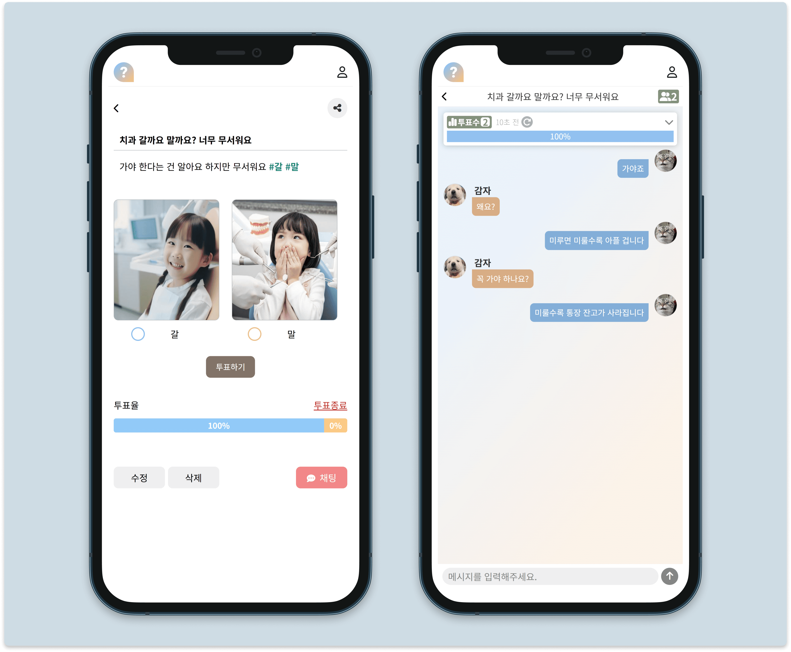

 

<b>ThisVsThat (이거저거)</b>는 사용자가 선택의 고민을 해결할 수 있도록 돕는 투표 기반 커뮤니티 플랫폼입니다.

 

‘이거? 저거?’와 같은 선택 상황을 게시글로 작성하면

다른 사용자들은 투표를 통해 의견을 표현하고, 채팅을 통해 실시간으로 의견을 나눌 수 있습니다.

 

OAuth 기반 소셜 로그인과 JWT 인증, WebSocket과 Redis를 활용한 실시간 채팅 기능을 구현했습니다.

GitHub Actions 기반 배포 자동화를 적용하고, AWS 기반 인프라를 구성했습니다.

 

팀원 전원이 기획부터 개발까지 전 과정에 참여했으며

Notion, Figma, Discord를 통해 작업을 관리하고 협업했습니다.

 
 

## 프로젝트 정보

- **유형**: 팀 프로젝트 (6명)

- **기간**: 2025.02.05 ~ 2025.03.03 (약 4주)

- **주요 기능**

    - 소셜 로그인

    - 게시판 (게시글 · 투표 · 실시간 채팅)

    - 마이페이지 (사용자 정보 관리, 작성글 · 투표 · 채팅방 조회)

    - 관리자 (금지 키워드 · 신고 게시글 · 회원 관리)

 
 

## 기술 스택

- **프론트엔드**: HTML, CSS, JavaScript, Thymeleaf

- **백엔드**: Java 17, Spring Boot, Spring Security, OAuth2, JWT, JPA

- **데이터베이스**: PostgreSQL

- **실시간 통신**: WebSocket, Redis

- **인프라 및 배포**: AWS (Elastic Beanstalk, RDS, S3), GitHub Actions

- **협업 도구**: Notion, Figma, Discord

 
 

## UI 설계

주요 화면을 중심으로 UI를 설계했습니다.

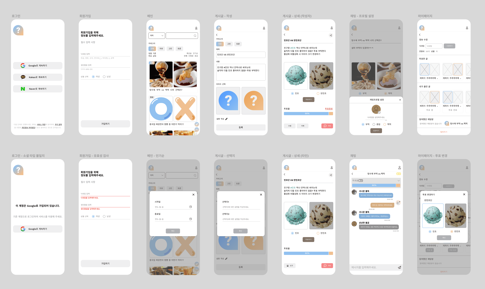

 
 

## DB 설계

  
ERD

   
  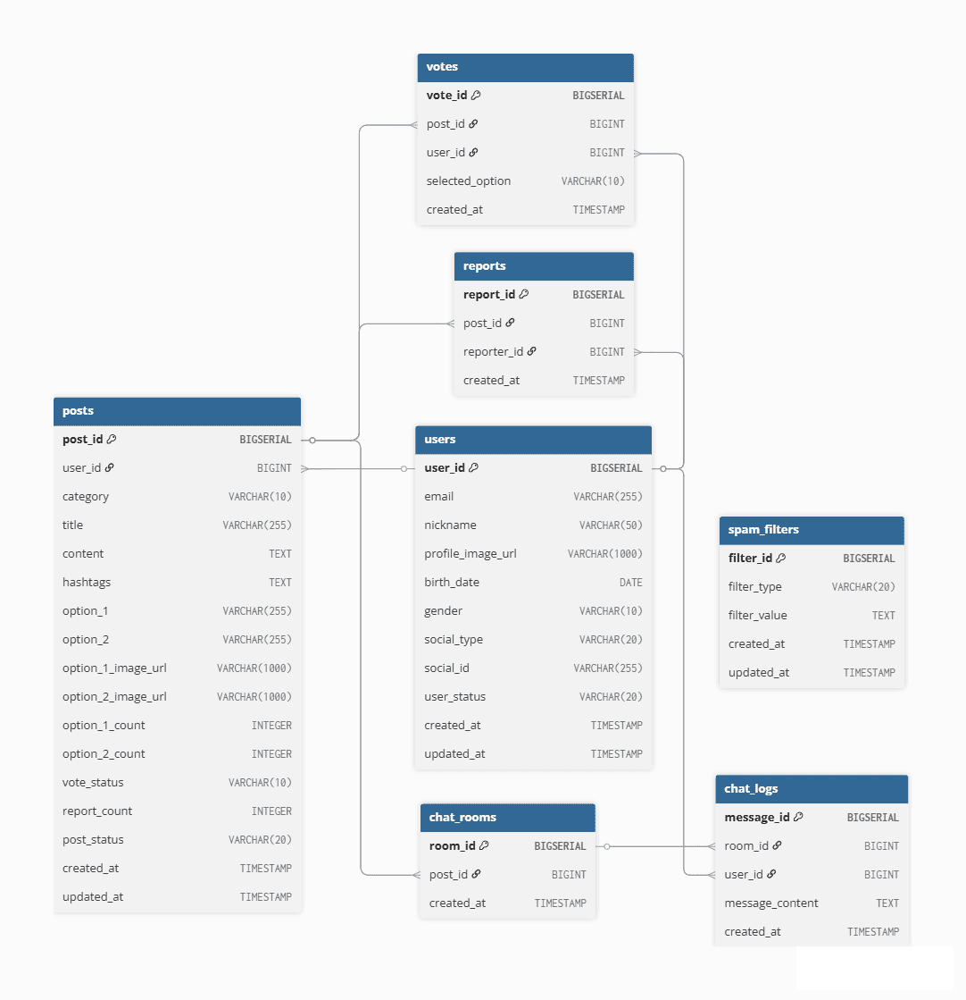

  
테이블 정의서

   
    🔗 
  <a href="https://docs.google.com/spreadsheets/d/1mTvRJdT4t2mSbCY8kNa42MzJLIDqUdk60PL16Zhfne4/edit?usp=sharing" target="_blank">
    테이블 정의서 확인하기
  </a>

 
 

## API 설계

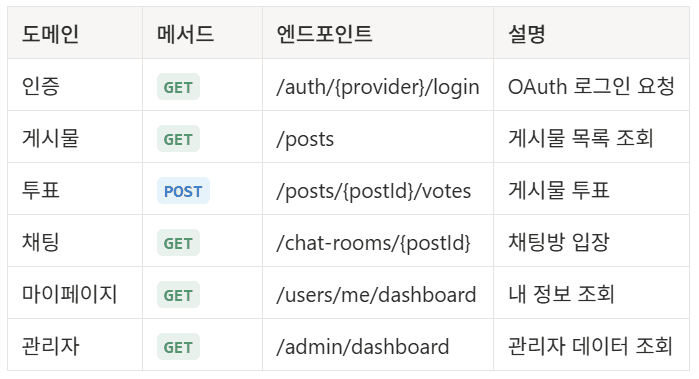

🔗 [전체 API 명세 보기](./docs/api-spec.md)

 
 

## 실행 화면

### 메인

카테고리, 정렬, 검색 조건 기반 게시글 조회 및 무한 스크롤을 지원합니다.

상세 페이지 진입 후 뒤로가기 시 목록과 스크롤 위치를 유지합니다.

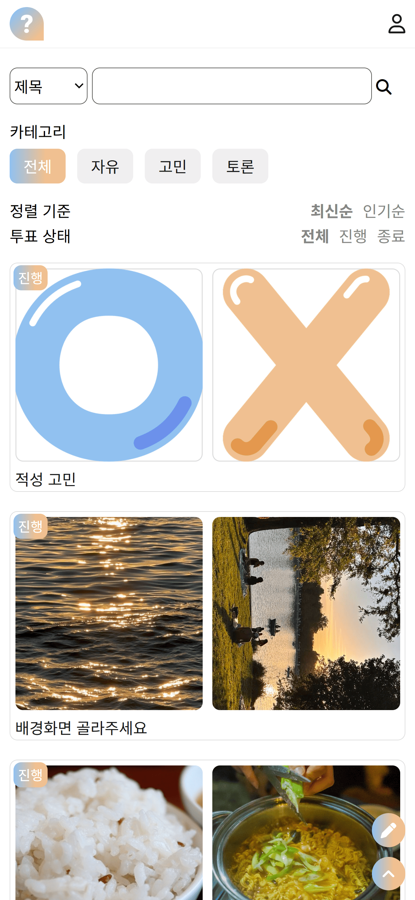

 

### 게시글

투표 선택지 및 결과를 확인하고, 투표와 채팅에 참여할 수 있습니다.

해시태그 조회와 URL 복사가 가능합니다.

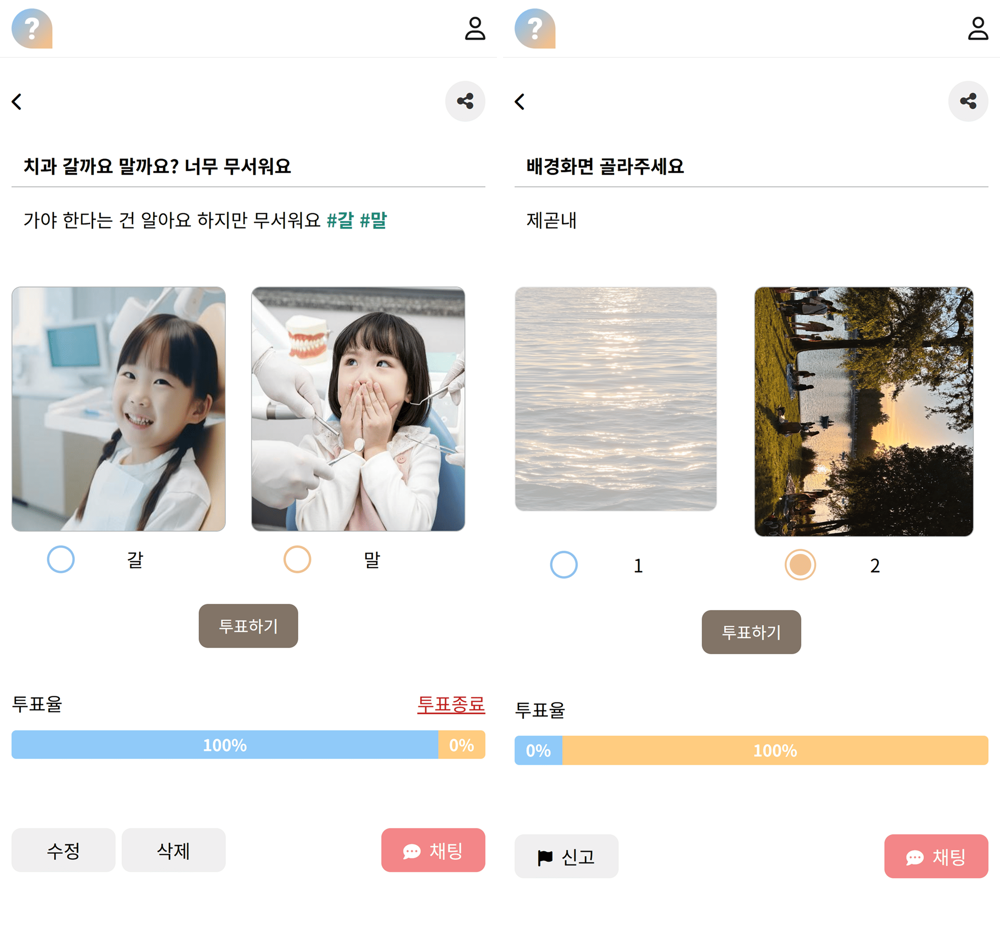

### 채팅

채팅 프로필 설정 후 채팅방에 입장할 수 있습니다.

투표 결과를 확인할 수 있으며, 갱신하거나 접어둘 수 있습니다.

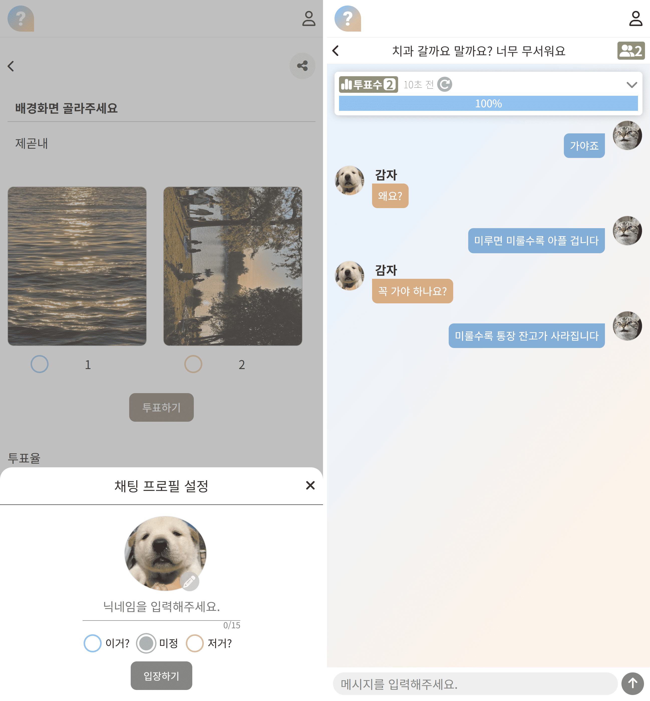

 

### 로그인 및 회원가입

Google, Kakao, Naver 소셜 로그인을 지원합니다.

최초 로그인 시 추가 정보를 입력한 뒤 회원가입이 완료됩니다.

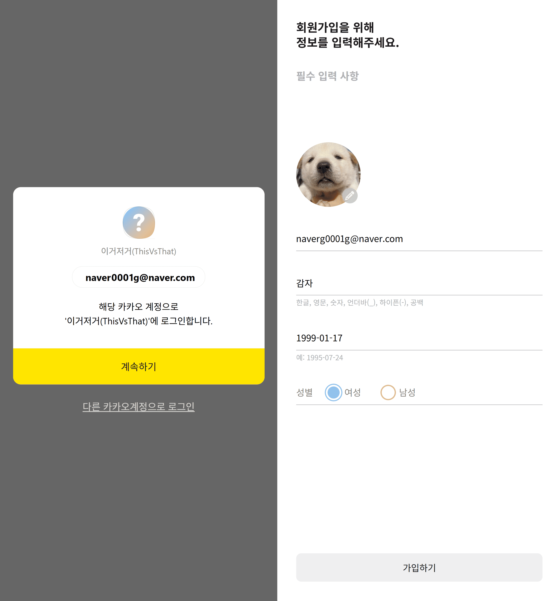

  
로그인 예외 및 안내

   
  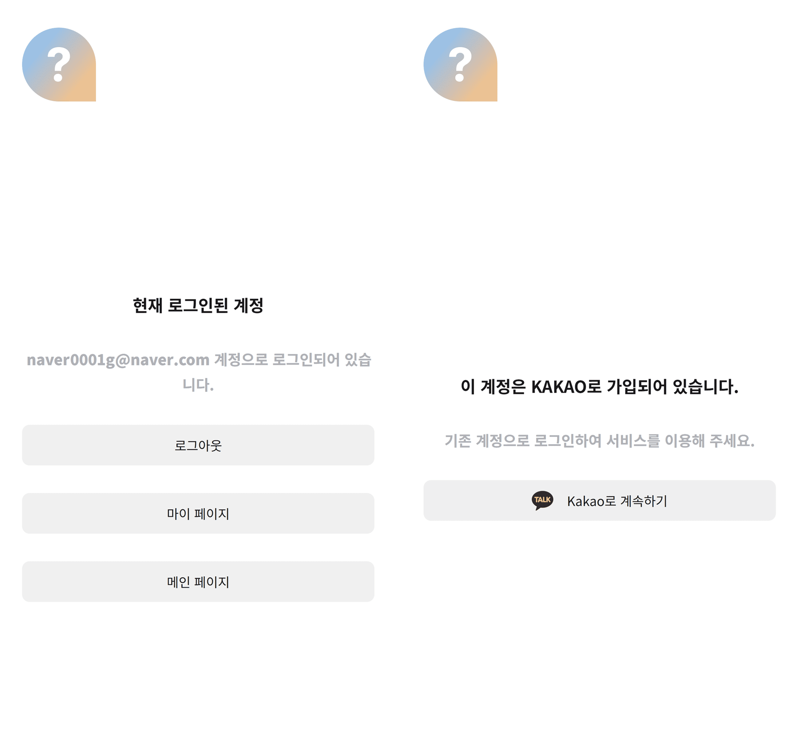

 

### 마이페이지

사용자 정보 조회 및 닉네임 수정이 가능합니다.

작성글, 투표한 글, 참여 채팅방 목록을 가로 스크롤로 확인할 수 있습니다.

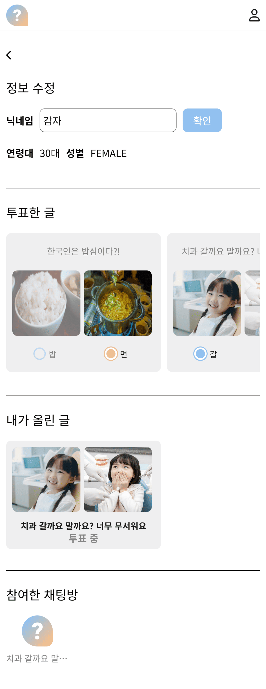

### 관리자

금지 키워드, 신고 사용자 및 게시글을 관리합니다.

신고 누적 기준에 따라 게시글 블라인드와 사용자 상태를 변경합니다.

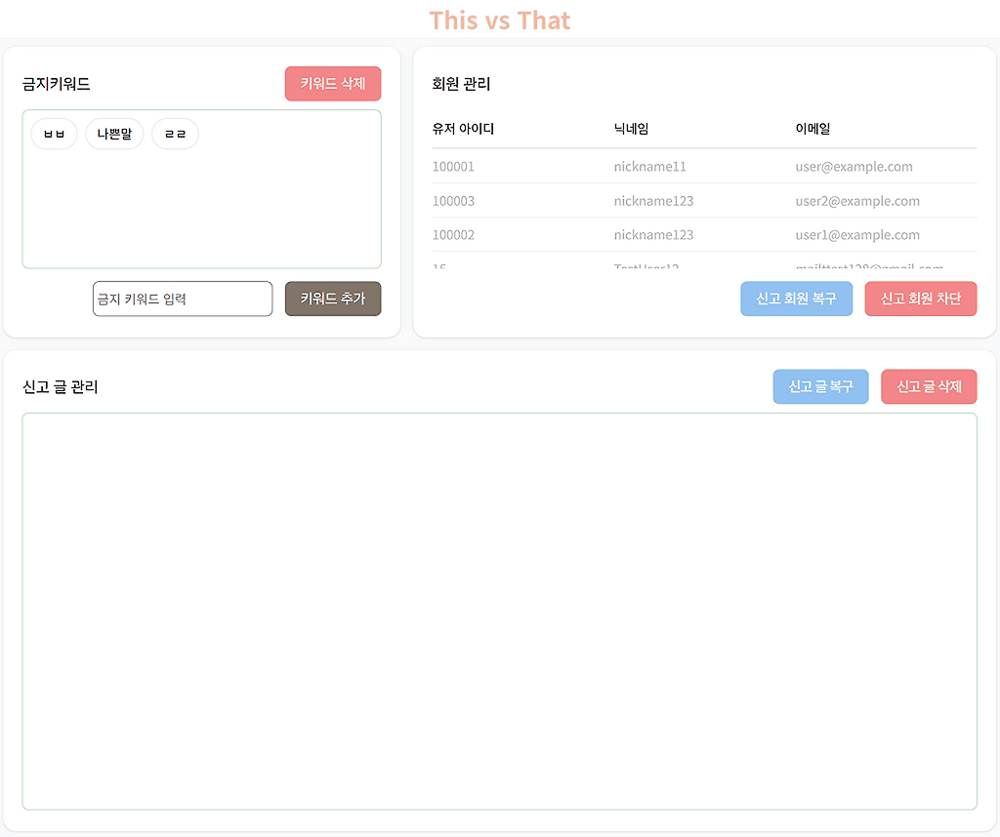

 
 

## 담당 역할

### 백엔드

- OAuth 소셜 로그인 및 JWT 인증

- 이미지 업로드 기능

- AWS 연동(Elastic Beanstalk, RDS, S3)

- GitHub Actions 기반 배포 자동화

### 프론트엔드

- 로그인/회원가입 관련 화면

- URL 복사, 뒤로가기 기능

- 공통 CSS 정리 및 UI 일관성 개선

### 문제 해결 및 개선

- JWT 저장 방식 개선 (HTTP-Only 쿠키 적용)

- 닉네임 중복 검사 결과 캐싱으로 API 호출 감소

- 모바일 브라우저 100vh 레이아웃 문제 대응

### 프로젝트 기여

- DB 설계 및 API 설계

- 협업 기준 문서 작성 및 공유

- 일정 관리 및 Git 협업 관리

 
 

## 관련 글

🔗 [프로젝트 소개 및 회고](https://velog.io/@kimkaaa/ThisVsThat-Project-%ED%94%84%EB%A1%9C%EC%A0%9D%ED%8A%B8-%EC%86%8C%EA%B0%9C-%EB%B0%8F-%ED%9A%8C%EA%B3%A0)

🔗 [GitHub Actions와 AWS 기반 배포 자동화](https://velog.io/@kimkaaa/ThisVsThat-Project-GitHub-Actions%EC%99%80-AWS-%EA%B8%B0%EB%B0%98-%EB%B0%B0%ED%8F%AC-%EC%9E%90%EB%8F%99%ED%99%94)

🔗 [JWT 저장 방식 개선 (HTTP-Only 쿠키 적용)](https://velog.io/@kimkaaa/ThisVsThat-Project-JWT-%EC%A0%80%EC%9E%A5-%EB%B0%A9%EC%8B%9D-%EA%B0%9C%EC%84%A0-HTTP-Only-%EC%BF%A0%ED%82%A4-%EC%A0%81%EC%9A%A9)

🔗 [닉네임 중복 검사 결과 캐싱으로 API 호출 감소](https://velog.io/@kimkaaa/ThisVsThat-Project-%EB%8B%89%EB%84%A4%EC%9E%84-%EC%A4%91%EB%B3%B5-%EA%B2%80%EC%82%AC-%EC%BA%90%EC%8B%B1%EC%9C%BC%EB%A1%9C-API-%ED%98%B8%EC%B6%9C-%EC%A4%84%EC%9D%B4%EA%B8%B0)

🔗 [모바일 브라우저 100vh 레이아웃 문제 대응](https://velog.io/@kimkaaa/ThisVsThat-Project-%EB%AA%A8%EB%B0%94%EC%9D%BC-%EB%B8%8C%EB%9D%BC%EC%9A%B0%EC%A0%80%EC%97%90%EC%84%9C-100vh-%ED%95%98%EB%8B%A8%EC%9D%B4-%EC%9E%98%EB%A6%AC%EB%8A%94-%EB%AC%B8%EC%A0%9C)

 
 

## 프로젝트 후기

프로젝트 초기에는 기획과 디자인을 함께 정리했고, 이후에는 문서와 리뷰를 바탕으로 작업을 조율했습니다.

OAuth 소셜 로그인과 회원가입은 Google, Kakao, Naver 기준으로 구현했고, JWT는 HTTP-Only 쿠키로 처리해 인증 상태를 관리했습니다.

로그인 이후에는 사용자 상태에 따라 흐름을 분기하고, 로그인 전 요청 페이지로 복귀할 수 있도록 했습니다.

 

회원가입에서는 닉네임 중복 검사에 디바운싱과 캐싱을 적용해 불필요한 요청을 줄이도록 했고, 최종 제출 시에는 다시 서버 기준으로 확인하도록 했습니다.

모바일 환경에서는 브라우저 높이 계산 문제로 하단 영역이 잘리는 현상이 있어, 로그인·회원가입 화면을 중심으로 높이 계산 방식을 보완했습니다.

 

협업 과정에서는 컨벤션, API 설계, 깃 운영 방식 등을 문서로 정리해 기준을 맞추려고 했지만, 실제 구현 단계에서는 문서만으로 충분하지 않은 부분도 있었습니다.

예를 들어 같은 성격의 기능이 서로 다른 방식으로 구현되거나, 설계와 구현이 일치하지 않는 경우도 있었고, 이런 부분은 코드 리뷰와 QA를 통해 다시 조율했습니다.

 

이 과정을 통해 작업을 시작하기 전에 기준을 정리하는 것도 중요하지만, 진행 중간에 지속적으로 점검하고 맞춰 가는 과정 역시 중요하다는 점을 느꼈습니다.

또한 깃 협업을 관리하면서 기능 구현뿐 아니라 프로젝트 전반의 흐름을 보는 경험을 할 수 있었습니다.
