# API 명세

 

## 1. 인증 / 로그인

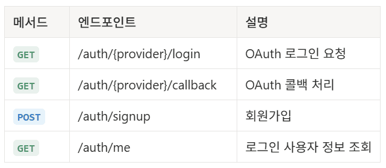

* `{provider}`: `google`, `kakao`, `naver`

 
 

## 2. 게시물 목록

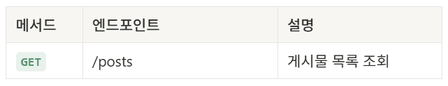

* 검색, 정렬, 필터, 무한 스크롤 → Query Parameter 처리

 
 

## 3. 게시물 관리

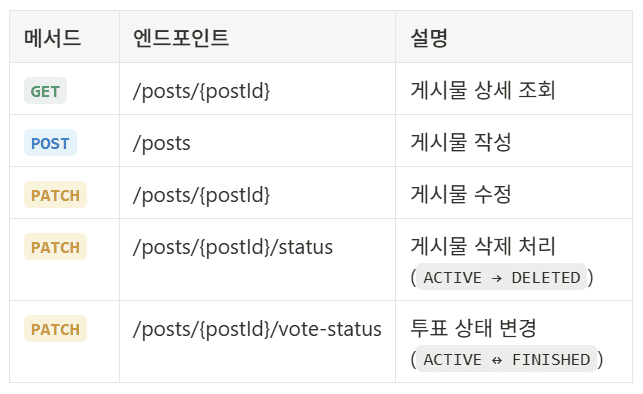

* 게시물 삭제 → 상태값 변경 (Soft Delete)

 
 

## 4. 투표 / 신고

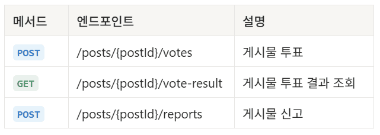

 
 

## 5. 마이페이지

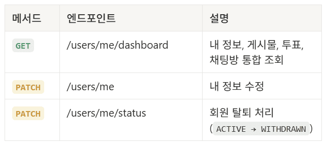

* 회원 탈퇴 → 상태값 변경

 
 

## 6. 채팅

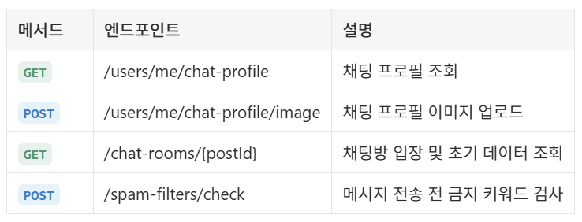

* 채팅방 → 게시물 기준 생성

 

### WebSocket

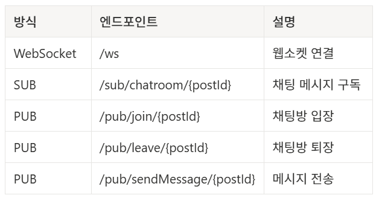

 
 

## 7. 관리자

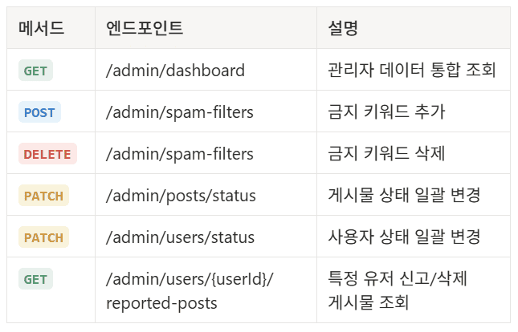

 
 

## 8. 상태 정의

### 유저 상태

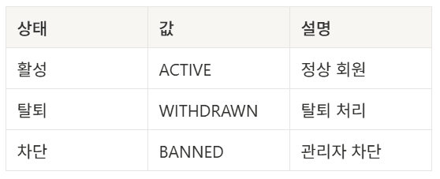

### 게시물 상태

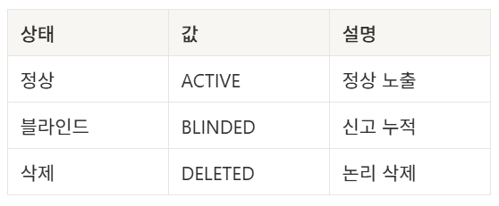

### 투표 상태

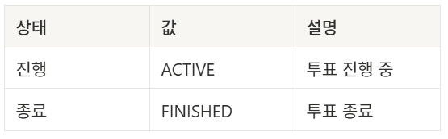

### 스팸 필터 유형

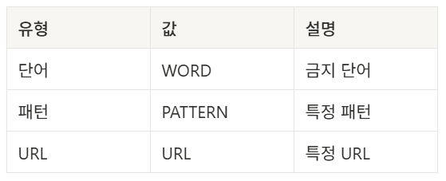
